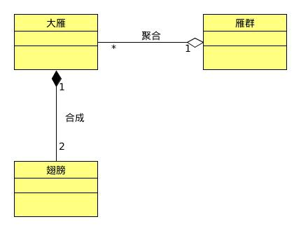

## 合成/聚合复用原则
> 合成、聚合复用原则（CARP），尽量使用合成/聚合，尽量不要使用类继承。[J&DP]

合成（Composition，也叫组合）和聚合（Aggregation）都是关联的特殊种类。
- 聚合表示一种弱的“拥有”关系，体现的是A对象可以包含B对象，但B对象不是A对象的一部分；
- 合成则是一种强的“拥有”关系，体现了严格的部分和整体的关系，部分和整体的生命周期一样。

## 优先使用合成/聚合复用原则，而不是类继承的原因
对象的继承关系是在编译时就定义好了，所以无法在运行时改变从父类继承的实现。
子类的实现与它的父类有非常紧密的依赖关系，以至于父类实现中的任何变化必然会导致子类发生变化。
当需要复用子类时，如果继承下来的实现不适合解决新的问题，则父类必须重写或别其他更适合的类替换。
这种依赖关系限制了灵活性并最终限制了复用性。

继承，是一种强耦合的结构。父类变，子类就必须要变。

## 合成/聚合复用原则的好处
- 优先使用对象的合成/聚合，将有助于保持每个类被封装，并被集中在单个任务上。
这样类和类继承层次会保持较小规模，并且不太可能增长为不可控制的庞然大物。
