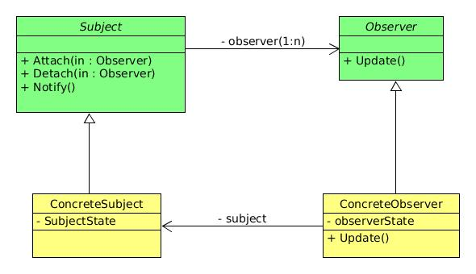

## 观察者模式

用到的设计原则：
- 开放-封闭原则，修改原有代码就说明设计不够好；
- 依赖倒转原则，我们应该让程序都依赖抽象，而不是相互依赖。

> 观察者模式（Observer）又叫做发布-订阅模式（Publish/Subscribe），定义了一种一对多的依赖关系，让多个观察者对象同时监听某一个主题对象，这个主题对象在状态发生变化时，会通知所有观察者对象，使它们能够自动更新自己。[DP]

- Subject类，它把所有对Observer对象的引用保存在一个容器中，每个Subject都可以有任何数量的观察者。抽象Subject提供一个接口，可以增加和删除观察者对象。
- Observer类，抽象观察者，为所有的具体观察者定义一个接口，在得到主题的通知时更新自己。
- ConcreteSubject类，具体Subject，将有关状态存入具体观察者对象，在ConcreteSubject的内部状态改变时，给所有登记过的观察者发出通知。
- ConcreteObserver类，具体Observer，实现抽象Observer所要求的更新接口，以便使本身的状态与Subject的状态相协调。

## 何时使用观察者模式？
当一个对象的改变需要同时改变其他对象的时候，而且它不知道具体有多少对象有待改变时，应该考虑使用观察者模式；  
观察者模式所做的工作其实就是在解除耦合。让耦合的双方都依赖于抽象，而不是依赖于具体。从而使得各自的变化都不会影响另一边的变化。

## 观察者模式的不足
尽管已经用了依赖倒转原则，但是“抽象通知者”还是依赖“抽象观察者”,也就是说，如果没有了抽象观察者这样的接口，通知的功能就完不成了；
另外，每个具体观察者，不一定是“Update()”方法要调用，也可能是其他不同名方法。

## 事件委托实现
对不同的具体观察者，去掉了抽象观察类，将Update()方法名改为各自适应的方法名。

> 委托就是一种引用方法的类型。一旦为委托分配了方法，委托将与该方法具有完全相同的行为。委托方法的使用可以像其他任何方法一样，具有参数和返回值。  
> 委托可以看作是对函数的抽象，委托的实例代表一个具体的函数。  
> 委托对象所搭载的所有方法必须具有相同的原形和形式，也就是拥有相同的参数列表和返回值类型。

即将函数注册给了通知者。
