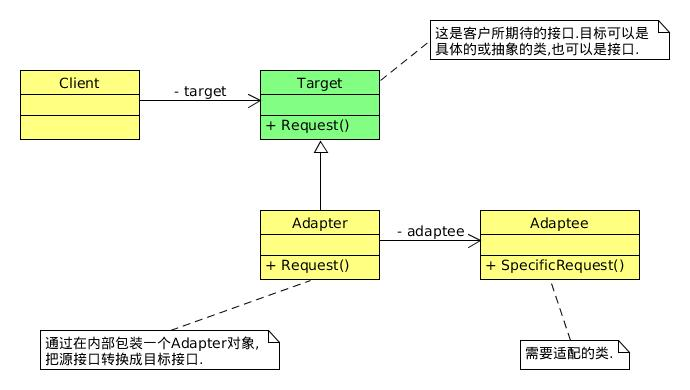

## 适配器模式

> 适配器模式(Adapter),将一个类的接口转换成客户希望的另一个接口.Adapter模式使得原本由于接口不兼容而不能一起工作的那些类可以一起工作.[DP]

## 何时使用适配器模式
使用一个已经存在的类,但如果它的接口和需要的不相同时,就应该考虑用适配器模式.

首先不应该考虑用适配器,而是应该考虑通过重构统一接口,只有双方都不太容易修改的时候再使用适配器模式适配.
