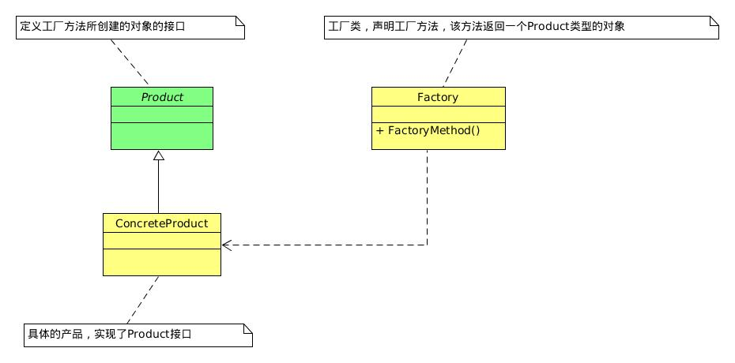
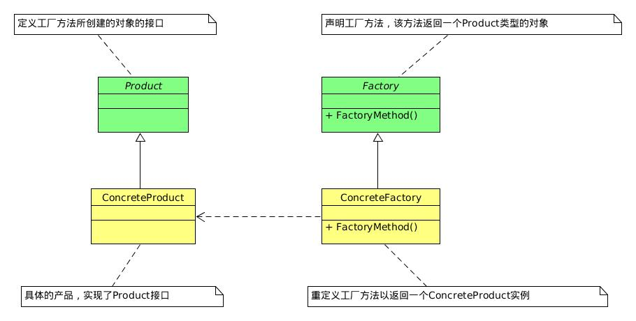
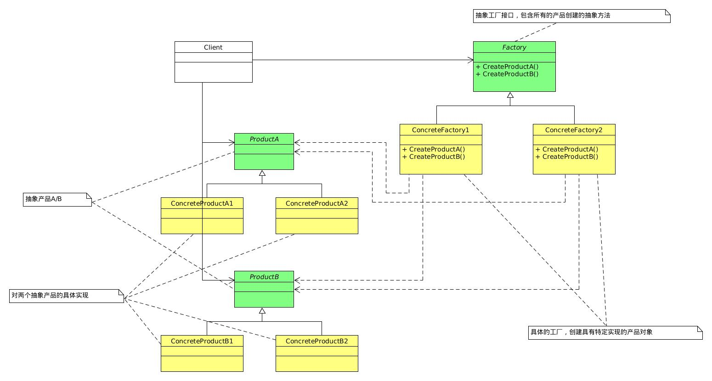

## 工厂模式
参考：  
[详解设计模式之工厂模式(简单工厂+工厂方法+抽象工厂)](https://www.cnblogs.com/toutou/p/4899388.html)

### 1. 简单工厂模式
#### 1.1 定义
> 简单工厂模式又叫静态工厂方法模式(Static Factory Method)，由一个工厂对象决定创建出哪一种产品类的实例。简单工厂模式是工厂模式家族中最简单实用的。

#### 1.2 简单工厂模式的优缺点
- 优点：简单工厂模式能够根据外界给定的信息，决定究竟应该创建哪个具体类的对象。
- 缺点：工厂类集中了所有的创建逻辑，容易违反高内聚的责任分配原则。

### 2. 工厂方法模式
#### 2.1 定义
> 工厂方法模式（Factory Method），定义一个用于创建对象的接口，让子类决定实例化哪一个类。工厂方法使一个类的实例化延迟到其子类。[DP]

工厂方法模式，又叫多态性工厂模式。在工厂方法模式中，核心的工厂类不再负责所有的产品创建，而是将具体创建工作交给子类去做。该核心类成为一个抽象工厂角色，仅负责给出具体工厂子类必须实现的接口，而不接触哪一个产品类应当被实例化的细节。  

#### 2.2 工厂方法模式的优点
- 优点：
	- 基类为工厂方法提供缺省实现，子类可以重写新的实现，也可以继承父类的实现。（多一层间接性，多一些灵活性）；
	- 面向抽象编程，只要产品的接口保持不变，系统中的上层模块就不会发生变化；
	- 典型的解耦框架，高层模块只需要知道产品的抽象类，其他的实现都不需要关心，符合迪米特法则、依赖倒置原则、里氏替换原则；
	- 多态性，客户代码可以做到与特定应用无关，适用于任何实体类；
	- 增加一个具体的产品，只需要添加一个具体的产品类和工厂类，不需要修改原有代码，符合开放-封闭原则。

### 3. 抽象工厂模式
#### 3.1 定义
> 抽象工厂模式（Abstract Factory），提供一个创建一系列相关或相互依赖对象的接口，而无需指定它们具体的类。[DP]

#### 3.2 抽象工厂模式的优缺点
- 优点：
	- 当一个产品族中的多个对象被设计成一起工作时，能保证客户端始终只使用同一个产品族中的对象；
	- 增加新的具体产品族和工厂时，无需修改原有代码，符合开放-封闭原则。
- 缺点：
