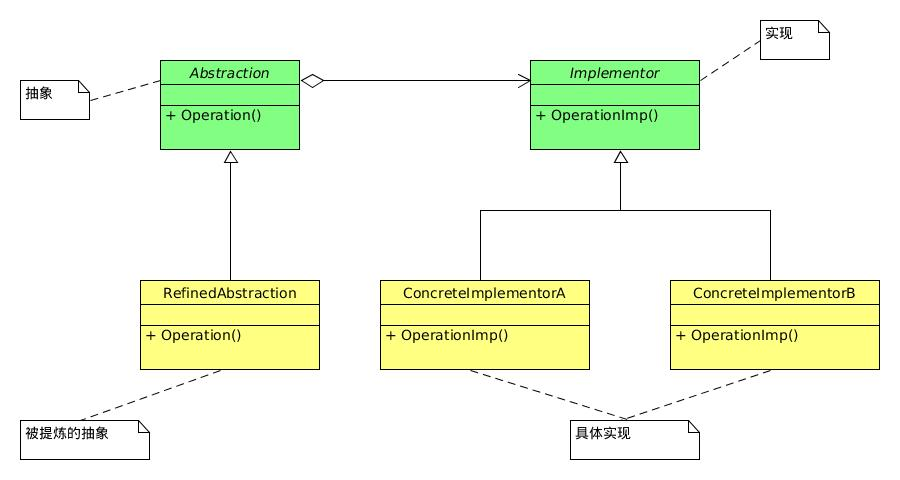

## 桥接模式
> 桥接模式（Bridge），将抽象部分与它的实现部分分离，使它们都可以独立地变化。[DP]

PS,什么叫抽象与它的实现分离，这并不是说，让抽象类与其派生类分离，因为这没有任何意义。实现指的是抽象类和它的派生类用来实现自己的对象。

## C++中桥接模式的作用
桥接设计模式，主要是为了隐藏数据以及减轻编译时的压力。  
通常的做法是另外定义一个新的类，其接口和原来的类一致，但是其数据全部隐藏在新的类中。  
例如我们定义A类，然后定义一个新类B和其有相同的接口，其数据成员都在新类中。引用A类的代码就不需要重新编译。   
   
## PS
只要真正深入地理解了设计原则，很多设计模式其实就是原则的应用而已，或许在不知不觉中就在使用设计模式了。

## pimpl用法
参考：
[ 编译防火墙——C++的Pimpl惯用法解析](http://blog.csdn.net/lihao21/article/details/47610309)
pimpl（Pointer to implementation），指向实现的指针。
