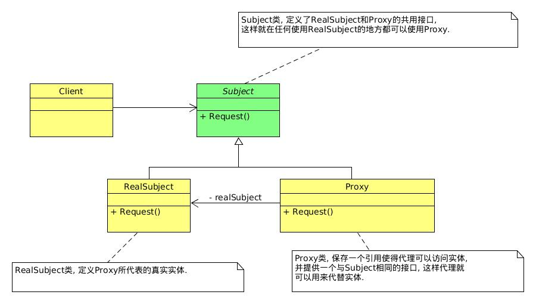

## 代理模式
> 代理模式(Proxy)，为其他对象提供一种代理以控制对这个对象的访问.[DP]

## 代理模式应用
1. 远程代理，也就是为一个对象在不同的地址空间提供局部代表。这样可以隐藏一个对象存在于不同地址空间的事实[DP].
2. 虚拟代理，根据需要创建开销很大的对象。通过它来存放实例化需要很长时间的真实对象[DP].
3. 安全代理，用来控制真实对象访问时的权限[DP].
4. 智能指引，是指当调用真实的对象时，代理处理另外一些事[DP].

代理模式其实就是在访问对象时引入一定程度的间接性，因为这种间接性，可以附加多种用途。  
说白了，代理就是真实对象的代表。
